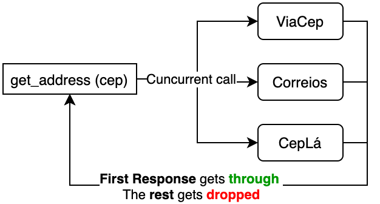

# lagoinha-rs

> Rust project inspired by https://github.com/IgorHalfeld/lagoinha used to retrieve Addresses from the Brazilian Postal Code (CEP)

❌ - This project is in the first stages of development, and should not be used in production.

✔️ - Contributions and reviews are appreciated !

---

<p align="center">
  <!--  -->
  <h3 align="center">
    Lagoinha-rs
  </h3>
  <p align="center">
    Lib Rust que retorna um endereço a partir do CEP <br/>
    utilizando as APIs públicas : Correios, ViaCEP, Ceplá
  </p>
  <p align="center">
    Readme in <a href="README.md">English</a>
  </p>
</p>

---


Lagoinha é basicamente um pacote que usa as APIs públicas para pegar o endereço com base em um CEP. O que o pacote faz, é disparar pra todas as APIs ao mesmo tempo e retornar com o resultado da primeira API que responder.

### Diagrama de funcionamento



### Por que esse nome

É simples, veja o [vídeo](https://www.youtube.com/watch?v=C1Sd_RWF5ks)!
(onde é que eu tô, lagoinha, CEP, endereço...)

### Instalação

```toml
lagoinha-rs = "0.1"
```

### How to use it
```rust
extern crate lagoinha;
extern crate async_std;

fn main() {
    let addr = async_std::task::block_on(lagoinha::get_address("CEP_GOES_HERE"));
    println!("{:#?}", addr);
}
```
O primeiro método deve ser similar para qualquer *async runtime*.

Ouem uma função Async (examplo usando Tokio):

```rust
extern crate lagoinha;
extern crate tokio;

#[tokio::main]
async fn main() {
    let addr = lagoinha::get_address("CEP_GOES_HERE").await;
    println!("{:#?}", addr);
}
```

### Run Examples

Check the [examples folder](examples/) !
To run them, use the commands below.

```bash
# these examples can be run with a specific CEP (or leave blank for default value)
cargo run --example get_address 20940040
cargo run --example get_address_tokio 20940040
cargo run --example standalone_services 20940040

```
### Nota sobre o HTTP Client

Essa lib usa [isahc](https://github.com/sagebind/isahc) com seu cliente http porquê:
1) Ela funciona em qualquer runtime async,
2) Ela oferece opção de configuração para Title-Case headers (necessário para CepLá)


---

## Todo

- [x] Get Started
- [x] Viacep service
- [x] Correios service
- [x] CepLá service
- [x] Separate Two languages in README.md
- [ ] Documentation
- [x] Invest in better error handling
- [ ] Unhappy path testing
- [ ] Validate input
- [ ] Different compilation features
- [ ] Abstractions: this will allow for mocking, and testing all paths without calls to the APIs
- [ ] Allow user to implement custom services, and opt out of any of the defaults

<!-- logo by [@nelsonsecco](https://twitter.com/nelsonsecco) -->
