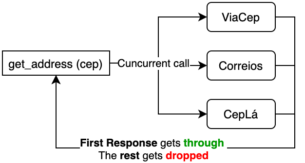

<p align="center">
  <!--  -->
  <h3 align="center">
    Lagoinha-rs
  </h3>
  <p align="center">
    Rust library that returns addresses from the Brazilian Postal Code (CEP) <br/>
    using the following APIs: Correios, ViaCEP, Cepla
  </p>
  <p align="center">
    Readme in <a href="README-pt.md">Português</a>
  </p>
</p>

> Rust project inspired by https://github.com/IgorHalfeld/lagoinha used to retrieve Addresses from the Brazilian Postal Code (CEP)

✔️ - Contributions and reviews are appreciated !

---


[](https://crates.io/crates/lagoinha)
[](https://docs.rs/lagoinha)
[](./LICENSE)

Lagoinha is a package that uses public APIs to fetch addresses using the Brazilian Postal Code (CEP). This package concurrently calls all the supported APIs and returns the first result to arrive.

### Diagram:



### Why this name ?

It means "little pond". It is a Brazillian meme ! Check the [vídeo](https://www.youtube.com/watch?v=C1Sd_RWF5ks)!

### Instalation

```toml
lagoinha-rs = "0.2"
```

### How to use it
```rust
use lagoinha;
use async_std;

fn main() {
    let addr = async_std::task::block_on(lagoinha::get_address("CEP_GOES_HERE"));
    println!("{:#?}", addr);
}
```
The first method should be similar for any async runtime.

Or in an Async function (example using Tokio):

```rust
use lagoinha;
use tokio;

#[tokio::main]
async fn main() {
    let addr = lagoinha::get_address("CEP_GOES_HERE", None).await;
    println!("{:#?}", addr);
}
```

### Run Examples

Check the [examples folder](examples/) !
To run them, use the commands below.

```bash
# these examples can be run with a specific CEP (or leave blank for default value)
cargo run --example get_address 20940040
cargo run --example get_address_tokio 20940040
cargo run --example standalone_services 20940040

```

### Note on the HTTP Client

This library uses [isahc](https://github.com/sagebind/isahc) as its http client because:
1) It works in any async backend, and 
2) It offers a configuration option for Title-Case headers (necessary for CepLá)


---

## Todo

- [x] Get Started
- [x] Viacep service
- [x] Correios service
- [x] CepLá service
- [x] Separate Two languages in README.md
- [ ] Documentation
- [x] Invest in better error handling
- [x] Unhappy path testing
- [ ] Validate input
- [ ] Different compilation features
- [ ] Abstractions: this will allow for mocking, and testing all paths without calls to the APIs
- [ ] Allow user to implement custom services, and opt out of any of the defaults

<!-- logo by [@nelsonsecco](https://twitter.com/nelsonsecco) -->
